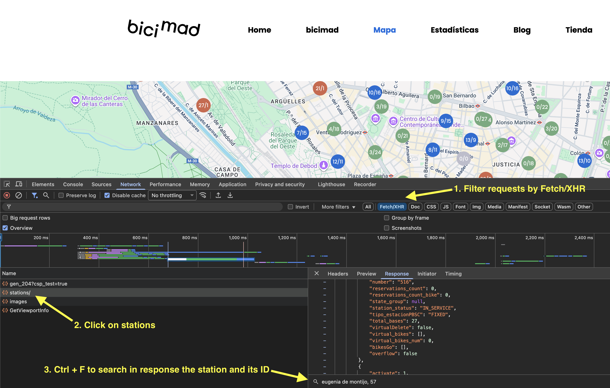

_Please :star: this repo if you find it useful_

# EMT Madrid bus and bicimad platform for Home Assistant

This is a custom sensor for Home Assistant that allows you to have the waiting time for a specific Madrid-EMT bus stop. Each sensor will provide the arrival time for the next 2 buses of the line specified in the configuration.
The integration also provides sensors to track the free docks and available bikes in BiciMad stations.

Thanks to [EMT Madrid MobilityLabs](https://mobilitylabs.emtmadrid.es/) for providing the data and [documentation](https://apidocs.emtmadrid.es/).


## Prerequisites

To use the EMT Mobilitylabs API you need to register in their [website](https://mobilitylabs.emtmadrid.es/). You have to provide a valid email account and a password that will be used to configure the sensor. Once you are registered you will receive a confirmation email to activate your account. It will not work until you have completed all the steps.

## Installation

### HACS installation

1. Open Home Assistant and go to HACS (Home Assistant Community Store).
2. In HACS, go to the "Integrations" tab and click on the three dots in the top right corner.
3. Select "Custom repositories" and enter the repository URL: `https://github.com/fermartv/emt_madrid`.
4. Select the category as "Integration" and click "Add."
5. Once the repository is added, search for "EMT-Madrid bus" in HACS and click "Install."
6. Restart Home Assistant.


### Manual installation

1. Using the tool of choice open the directory for your HA configuration (where you find `configuration.yaml`).
2. If you do not have a `custom_components` directory there, you need to create it.
4. Download _all_ the files from the `custom_components` directory in this repository.
5. Place the files you downloaded in the new directory you created.
6. Restart Home Assistant

## Add emt_buses sensor to Home Assistant

Add `emt_buses` sensor to your `configuration.yaml` file:

   ```yaml
   # Example configuration.yaml entry
   sensor:
     - platform: emt_buses
       email: !secret EMT_EMAIL
       password: !secret EMT_PASSWORD
       stop: 72
       lines: 
         - "27"
         - "N26"
       icon: "mdi:fountain"
   ```

### Configuration Variables

**email**:\
 _(string) (Required)_\
 Email account used to register in the EMT Madrid API.

**password**:\
 _(string) (Required)_\
 Password used to register in the EMT Madrid API.

**stop**:\
 _(integer) (Required)_\
 Bus stop ID.

**lines**:\
 _(list) (Optional)_\
 One or more line numbers.

**icon**:\
 _(string) (Optional)_\
 Icon to use in the frontend.
_Default value: "mdi:bus"_


### Sensors, status and attributes

Once you have the platform up and running, you will have one sensor per line specified. If no lines are provided, it will create a sensor for each line at that stop ID. The name of the sensor will be automatically generated using the following structure: Bus {line} - {stop_name}. All the sensors will update the data automatically every minute, and you should have the following data:

**state**:\
 _(int)_\
 Arrival time in minutes for the next bus. It will show "unknown" when there are no more buses coming and 45 when the arrival time is over 45 minutes.

### Attributes

**next_bus**:\
 _(int)_\
 Arrival time in minutes for the second bus. It will show "unknown" when there are no more buses coming and 45 when the arrival time is over 45 minutes.

**stop_id**:\
 _(int)_\
 Bus stop ID given in the configuration.

**stop_name**:\
 _(string)_\
 Bus stop name from EMT.

**stop_address**:\
 _(string)_\
 Bus stop address from EMT.

**line**:\
 _(string)_\
 Bus line.

**destination**:\
 _(string)_\
 Bus line last stop.

**origin**:\
 _(string)_\
 Bus line first stop.

**start_time**:\
 _(string)_\
 Time at which the first bus leaves the first stop.

**end_time**:\
 _(string)_\
 Time at which the last bus leaves the first stop.

**max_frequency**:\
 _(int)_\
 Maximum frequency for this line.

**min_frequency**:\
 _(int)_\
 Minimum frequency for this line.

**distance**:\
 _(int)_\
 Distance (in metres) from the next bus to the stop.


### Multiple stops

If you want to follow multiple stops, you can create multiple sensors by adding the following lines to your `configuration.yaml`:

   ```yaml
   # Example configuration.yaml entry
   sensor:
     - platform: emt_madrid
       email: !secret EMT_EMAIL
       password: !secret EMT_PASSWORD
       stop: 72
       lines: 
         - "27"
         - "N26"
       icon: "mdi:fountain"

     - platform: emt_madrid
       email: !secret EMT_EMAIL
       password: !secret EMT_PASSWORD
       stop: 4490
       icon: "mdi:bus-clock"
   ```


### Second bus sensor

If you want to have a specific sensor to show the arrival time for the second bus, you can add the following lines to your `configuration.yaml` file below the `emt_madrid` bus sensor. See the official Home Assistant [template sensor](https://www.home-assistant.io/integrations/template/) for more information.

```yaml
# Example configuration.yaml entry
template:
  - sensor:
      - name: "Siguiente bus 27"
        unit_of_measurement: "min"
        state: "{{ state_attr('sensor.bus_27_cibeles_casa_de_america', 'next_bus') }}"
```

## Add emt_bicimad sensor to Home Assistant

Add `emt_bicimad` sensor to your `configuration.yaml` file:

   ```yaml
   # Example configuration.yaml entry
   sensor:
     - platform: emt_bicimad
       email: !secret EMT_EMAIL
       password: !secret EMT_PASSWORD
       station_id: 2139
       icon: "mdi:bike"
   ```

### Configuration Variables

**email**:\
 _(string) (Required)_\
 Email account used to register in the EMT Madrid API.

**password**:\
 _(string) (Required)_\
 Password used to register in the EMT Madrid API.

**station_id**:\
 _(integer) (Required)_\
 Bicimad station ID (different from station number).
 Station ID can be obtained from [BiciMad webpage](https://www.bicimad.com/mapa) as it shows the following image.



**icon**:\
 _(string) (Optional)_\
 Icon to use in the frontend.
_Default value: "mdi:bus"_

### Attributes

**station_id**:\
 _(int)_\
 Station ID given in the configuration.

**station_number**:\
 _(int)_\
 Station number as it shows in BiciMad App.

**station_name**:\
 _(string)_\
 Station name from EMT.

**station_address**:\
 _(string)_\
 Station address from EMT.

**free_bases**:\
 _(int)_\
 Number of free bases to dock bikes into.

**bikes**:\
 _(int)_\
 Number of available bikes in the station.

**unit_of_measurement**:\
 _(string)_\
 Unit of measurement for the sensor.

**station_coordinates**:\
 _(list)_\
 Geographic coordinates of the station.

## Roadmap

1. Move to fully async component.
2. Add `unique_id` to allow modifying sensor names.
